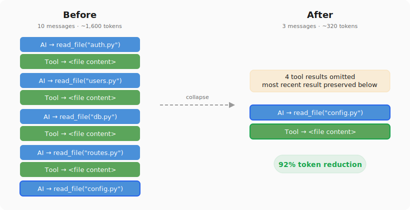

# langchain-collapse

[](https://pypi.org/project/langchain-collapse/)
[](https://opensource.org/licenses/MIT)
[](https://github.com/johanity/langchain-collapse/actions)

Preventive context management for LangChain agents.

When an agent reads ten files in a row, those twenty messages stay in context long after they've been processed. This middleware quietly collapses them into a single line, keeping only the most recent result. The expensive stuff (LLM summarization) triggers less often.

No LLM calls. No hallucination risk. Stateless.

<p align="center">
  
</p>

## Quick Install

```bash
pip install langchain-collapse
```

## 🤔 What is this?

Agents burn through context by accumulating tool results they've already processed. A typical file exploration phase (8 reads, 4 greps) can eat thousands of tokens that just sit there. CollapseMiddleware scans for these repetitive groups and replaces the older ones with a short note, keeping the last result visible to the model.

On a [realistic coding session](examples/benchmark.py), this produces a 92% token reduction. When paired with `SummarizationMiddleware`, summarization triggers [4.2x later](examples/benchmark.py) because context fills up more slowly.

```python
from langchain.agents import create_agent
from langchain_collapse import CollapseMiddleware

agent = create_agent(
    model="anthropic:claude-sonnet-4-6",
    tools=[...],
    middleware=[CollapseMiddleware()],
)
```

### With SummarizationMiddleware

Place `CollapseMiddleware` first. It reduces the message count before summarization decides whether to fire:

```python
from langchain.agents.middleware import SummarizationMiddleware

middleware = [
    CollapseMiddleware(),
    SummarizationMiddleware(
        model="anthropic:claude-haiku-4-5-20251001",
        trigger=("fraction", 0.85),
    ),
]
```

### Configuration

```python
CollapseMiddleware(
    collapse_tools=frozenset({"read_file", "grep", "glob", "web_search"}),  # default
    min_group_size=2,  # minimum consecutive pairs to collapse
)
```

## 📖 Documentation

- [Source](langchain_collapse/__init__.py) (single file, ~150 lines)
- [Benchmark](examples/benchmark.py) (realistic session with token counts)
- [Tests](tests/) (unit tests + property-based invariant tests)

## 💁 Contributing

```bash
git clone https://github.com/johanity/langchain-collapse.git
cd langchain-collapse
pip install -e ".[test]"
pytest
```

## 📕 License

MIT
